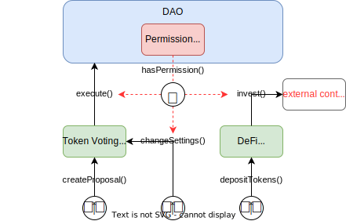

<p align="center">
  <a href="https://aragon.org/">Aragon website</a>
  •
  <a href="https://devs.aragon.org/">Developer Portal</a>
  •
  <a href="https://aragonproject.typeform.com/to/LngekEhU">Join our Developer Community</a>
  •
  <a href="https://aragonproject.typeform.com/dx-contribution">Contribute</a>
</p>

<br/>

# Aragon OSx Protocol

The Aragon OSx protocol is the foundation layer of the new Aragon stack. It allows users to create, manage, and customize DAOs in a way that is lean, adaptable, and secure.

Within this monorepo, you will be able to find 3 individual packages:

- [Contracts](https://github.com/aragon/osx/tree/develop/packages/contracts): the Aragon OSx protocol contracts.
- [Subgraph](https://github.com/aragon/osx/tree/develop/packages/subgraph): contains all code generating our subgraph and event indexing.
- [Contract-ethers](https://github.com/aragon/osx/tree/develop/packages/contracts-ethers): contains the connection between the ethers package and our contracts.

The contents of this repository are distributed via 3 different NPM packages:

- `@aragon/osx`: The source files, including the protocol contracts and interfaces
- `@aragon/osx-artifacts`: The contracts bytecode and ABI to use the protocol or deploy it
- `@aragon/osx-ethers`: The TypeScript wrappers to use the protocol or deploy it using ethers.js

For more information on the individual packages, please read the respective `README.md`.

## Audits

OSx smart contracts undergo regular audits.

### v1.4.0

**Halborn**: [audit report](./audits/Halborn_AragonOSx_v1_4_Smart_Contract_Security_Assessment_Report_2025_01_03.pdf)

- Commit ID: [e0ba7b60b08fa1665ecac92dc12ea89e4245e7dc](https://github.com/aragon/osx/commit/e0ba7b60b08fa1665ecac92dc12ea89e4245e7dc)
- Started: 2024-11-18
- Finished: 2025-02-13

### v1.3.0

**Code4rena**: [link 1](./audits/Code4rena_AragonOSx_2023-12-12.pdf), [link 2](https://code4rena.com/reports/2023-03-aragon)

- Commit ID: [a2461ae61a8c4cc833a117120b76e306936f5e1c](https://github.com/aragon/osx/commit/a2461ae61a8c4cc833a117120b76e306936f5e1c)
- Started: 2023-03-03
- Finished: 2023-03-10

**Halborn**: [link 1](./audits/Halborn_AragonOSx_2023-06-13.pdf), [link 2](https://github.com/HalbornSecurity/PublicReports/blob/b3fe424535dce7ce345f74dc7e6c25e9200e7860/Solidity%20Smart%20Contract%20Audits/Aragon_aragonOS_v1_3_0_Smart_Contract_Security_Assessment_Report_Halborn_Final.pdf)

- Commit ID: [0ad8cad2bb661fbd53086d097d11228304d9b73e](https://github.com/aragon/osx/commit/0ad8cad2bb661fbd53086d097d11228304d9b73e)
- Started: 2023-05-29
- Finished: 2023-06-13

### v1.0.0

**Halborn**: [link 1](./audits/Halborn_AragonOSx_2023-02-24.pdf), [link 2](https://github.com/HalbornSecurity/PublicReports/blob/b3fe424535dce7ce345f74dc7e6c25e9200e7860/Solidity%20Smart%20Contract%20Audits/Aragon_aragonOS_Smart_Contract_Security_Audit_Report_Halborn_Final.pdf)

- Commit ID: [cb0621dc5185a73240a6ca33fccc7698f059fdf5](https://github.com/aragon/osx/commit/cb0621dc5185a73240a6ca33fccc7698f059fdf5)
- Started: 2023-02-07
- Finished: 2023-02-24

## Contributing

We'd love to hear what you think! If you want to build this with us, please find a detailed contribution guide in the `CONTRIBUTION_GUIDE.md` [file here](https://github.com/aragon/osx/blob/develop/CONTRIBUTION_GUIDE.md).

## Security

If you believe you've found a security issue, we encourage you to notify us. We welcome working with you to resolve the issue promptly.

Security Contact Email: sirt@aragon.org

Please do not use the issue tracker for security issues.

## Setup

Ensure you have Node and Yarn installed.

The latest Node version officially supported by OSx and Hardhat is 16. Node >=19 also works, but is technically unsupported by Hardhat. It's recommended to use a tool such as [nvm](https://github.com/nvm-sh/nvm) to manage different node environments. Please see the relevant documentation for details.

Start by running `yarn --ignore-scripts` in the project root in your terminal.

### Dependencies

Since the repo is set up as yarn workspace, all the linking is done automatically. When contributing, we recommend to `cd` into each package, as this mirrors the workflow of the development team.

## How the Aragon OSx protocol works

To review the contracts powering the Aragon OSx protocol, feel free to head to `packages/contracts`.

The Aragon OSx protocol architecture is composed of two key sections:

- **Core contracts**: the primitives the end user will interact with. It is composed of mostly 3 parts:
  - **DAO contract:** the main contract of our core. It holds a DAO's assets and possible actions.
  - **Permissions**: govern interactions between the plugins, DAOs, and any other address - allowing them (or not) to execute actions on behalf of and within the DAO.
  - **Plugins**: base templates of plugins to build upon.
- **Framework contracts**: in charge of creating and registering each deployed DAO or plugin. It contains:
  - **DAO and Plugin Repository Factories**: creates DAOs or plugins.
  - **DAO and Plugin Registries**: registers into our protocol those DAOs or plugins.
  - **Plugin Setup Processor:** installs and uninstalls plugins into DAOs.

Additionally to those two sections, we have developed several plugins DAOs can easily install upon creation. These are:

- **Token Voting plugin**: enables token holders to vote yes, no or abstain on incoming DAO proposals
- **Multisig plugin**: enables DAO governance based on approval from a pre-defined members list.
- **Addresslist Voting plugin**: enables a pre-defined set of addresses to vote yes, no or abstain in a "one address, one vote" mode
- **Admin plugin**: enables full access to an account needing to perform initial maintenance tasks without unnecessary overhead

Let's dive into more detail on each of these sections.

### Core Contracts

The _Core Contracts_ describe how every DAO generated by the Aragon OSx protocol will be set up. It is very lean by design and constitutes the most critical aspects of our architecture.

In a nutshell, each DAO is composed of 3 interconnecting components:

1. **The DAO contract:** The DAO contract is where the **core functionality** of the DAO lies. It is the contract in charge of:
   - Representing the identity and metadata of the DAO (ENS name, logo, description, other metadata)
   - Holding and managing the treasury assets
   - Executing arbitrary actions to:
     - transfer assets
     - call its own functions
     - call functions in external contracts
   - Providing general technical utilities like callback handling and others
2. **Permissions:** Permissions are an integral part of any DAO and the center of our protocol architecture. The Permissions manager **manages permissions for the DAO** by specifying which addresses have permission to call distinct functions on contracts associated with your DAO. This Permissions manager lives inside the DAO contract.
3. **Plugins**: Any custom functionality can be added or removed through plugins, allowing you to **fully customize your DAO**. You'll find some base templates of plugins within the `plugins` folder of the _Core Contracts_. Some examples of plugins that DAOs could install are:
   - Governance (e.g., token voting, one-address one-vote)
   - Asset management (e.g., ERC-20 or NFT minting, token streaming, DeFi)
   - Membership (governing budget allowances, access gating, curating a member list)

The following graphic shows an exemplary DAO setup:



An examplary DAO setup showing interactions between the three core contract pieces triggered by different user groups: The `DAO` and `PermissionManager` contract in blue and red, respectively, as well as two `Plugin` contracts in green. Bear in mind, the `DAO` and `Permission Manager` components both coexist within the same `DAO` contract. Function calls are visualized as black arrows and require permission checks (red, dashed arrow). In this example, the permission manager determines whether the token voting plugin can execute actions on the DAO, a member can change its settings, or if an DeFi-related plugin is allowed to invest in a certain, external contract.

### Framework Contracts

In contrast, the _Framework Contracts_ are in charge of creating and registering DAOs and plugins. Additionally, these contracts contain the `PluginSetupProcessor` which installs, uninstalls, and updates plugins into DAOs upon request.

- **Factories and Registries**
  - **The DAO Factory**: In charge of deploying instances of a new DAO based on the parameters given, including which plugins to install and additional metadata the DAO has (like a name, description, etc).
  - **The DAO Registry**: In charge of registering DAOs into our protocol so plugins can easily access all DAO instances within our protocol. It is also in charge of giving DAOs subdomains for easier access.
  - **The Plugin Factory**: A `PluginRepo` is the repository of versions for a given plugin. The `PluginRepoFactory` contract creates a `PluginRepo` instance for each plugin, so that plugins can update their versioning without complexity in a semantic way similar to the App Store.
  - **The Plugin Registry**: In charge of registering the `PluginRepo` addresses into our protocol so that DAOs can access all plugins published in the protocol.
- **Plugin Setup Processor**: The processor is the manager for plugins. It installs, uninstalls, and upgrades plugins for DAOs based on the instructions provided by the plugin setup.

For a more detailed description of each of these components, please visit our [Developer Portal](https://devs.aragon.org).

### Plugins

Each plugin consists of two key components:

- **The Plugin Logic**: contains the logic for each plugin; the main functionality the plugin extends for the DAO. Can be linked to other helper contracts if needed.
- **The Plugin Setup**: contains the installation, uninstallation, and upgrade instructions for a plugin into a DAO.

You can find all plugins built by the Aragon team [here](https://github.com/aragon/osx/tree/develop/packages/contracts/src/plugins).

### Connection between OSx, subgraph, and ethers.js packages

The [Aragon OSx contracts](https://github.com/aragon/osx/tree/develop/packages/contracts) emits events that get indexed within our `subgraph`. This `subgraph`, whose [source code can be found here](https://github.com/aragon/osx/tree/develop/packages/subgraph), is what then fuels the [Aragon SDK](https://github.com/aragon/sdk).

The [contract-ethers](https://github.com/aragon/osx/tree/develop/packages/contracts-ethers) package is the NPM package that provides `ethers.js` wrappers to use the [Aragon OSx contracts](https://github.com/aragon/osx/tree/develop/packages/contracts).

## Tests

To run tests, run these commands in the root folder in your terminal:

```bash
npx hardhat accounts
npx hardhat compile
npx hardhat clean
npx hardhat test
npx hardhat node
npx hardhat help
REPORT_GAS=true npx hardhat test
npx hardhat coverage
```

For faster runs of your tests and scripts, consider skipping `ts-node`'s type checking by setting the environment variable `TS_NODE_TRANSPILE_ONLY` to `1` in hardhat's environment.

For more details see [the documentation](https://hardhat.org/guides/typescript.html#performance-optimizations).

## Deployment

To deploy contracts, run these commands in your terminal:

```bash
npx hardhat run scripts/deploy.ts
TS_NODE_FILES=true npx ts-node scripts/deploy.ts
npx eslint '**/*.{js,ts}'
npx eslint '**/*.{js,ts}' --fix
npx prettier '**/*.{json,sol,md}' --check
npx prettier '**/*.{json,sol,md}' --write
npx solhint 'contracts/**/*.sol'
npx solhint 'contracts/**/*.sol' --fix
```

You can find more details about [our deployment checklist here](https://github.com/aragon/osx/blob/develop/DEPLOYMENT_CHECKLIST.md).

## Publishing protocol upgrades

Follow [our update checklist here](https://github.com/aragon/osx/blob/develop/UPDATE_CHECKLIST.md).

## Pull request commands

Certain actions can be triggered via a command to a pull request. To issue a command just comment on a pull request with one of these commands.

| Command                                      | Description                                                 |
| -------------------------------------------- | ----------------------------------------------------------- |
| `/mythx partial (quick \| standard \| deep)` | Scans the changed files for this pull request               |
| `/mythx full (quick \| standard \| deep)`    | Scans the all files for this pull request                   |
| `/release (patch \| minor \| major)`         | Adds the proper release label to this pull request          |
| `/subgraph (patch \| minor \| major)`        | Adds the proper subgraph release label to this pull request |
