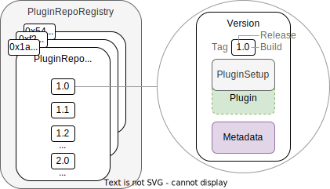

## The Plugin Repo Contract

:::note
This section is work in progress.
:::

In this section you will learn what plugin repositories and related aragonOS infrastructure works.

### What are Plugin Repos Needed For?

Each plugin has its own, unique ENS name and on-chain repository contract, the `PluginRepo`, in which different versions of the plugin are stored for reference.

<!--The names and address of the `PluginRepo` contracts are stored in the `PluginRepoRegistry`. Both contracts are described in the following. -->

The `PluginSetupProcessor` contract taking care of installing, updating, and uninstalling is described in the context of [the plugin setup process](04-plugin-setup.md).

<div class="center-column">



<p class="caption"> 
  Schema showing the `PluginRepoRegistry` maintaining a list the addresses of ENS named `PluginRepo` contracts shown on the left. Each `PluginRepo` contract maintains a list of semantic versions of the `PluginSetup` contract (internally referencing the `Plugin` logic) and the associated UI building blocks as a URI, examplarily shown on the right.
</p>

</div>

### The `PuginRepo` Contract

The `PluginRepo` contract versions the releases of a `Plugin`. Each plugin starts as version `1.0`.
When you release the first version of a plugin, a new plugin repository is created for you by the aragonOS framework in which you are the maintainer. The creation process is described in the [plugin repo creation process](01-plugin-repo-creation.md) section.

The `PluginRepo` contract inherits from the `PermissionManager` <!-- add link --> and allows the maintainer of the repository to create new versions with the `createVersion` function:

:::note
This section is work in progress.
:::

 <!--Subsequent versions follow the [semantic versioning convention](https://semver.org/). For major, minor, and patch releases, the respective [version numbers are incremented](docs/core/../../../../../02-how-to-guides/01-plugin-development/03-publication/02-versioning.md).Each semantic version released in the `PluginRepo` contract via the `createVersion` function-->

```solidity title="contracts/framework/PluginRepo.sol"
/// @notice Creates a new version with contract `_pluginSetupAddress` and content `@fromHex(_buildMetadata)`.
/// @param _release The release number.
/// @param _pluginSetupAddress The address of the plugin setup contract.
/// @param _buildMetadata The build metadata URI.
/// @param _releaseMetadata The release metadata URI.
function createVersion(
  uint8 _release,
  address _pluginSetup,
  bytes calldata _buildMetadata,
  bytes calldata _releaseMetadata
) external auth(address(this), MAINTAINER_PERMISSION_ID);
```

This function requires four pieces of information

- The release number to create the build for.
- The address of `PluginSetup` contract internally referencing the implementation contract (to copy, proxy, or clone from it) and taking care of [installing, updating to, and uninstalling](04-plugin-setup.md) this specific version.
- the metadata URI, which point to JSON files containing UI, setup, and other information.

<!-- explain how plugin setups are versioned-->

Other functions allow you to query previous versions and to update the metadata of a release.

For more details visit the [`PluginRepo` reference guide entry](../../../../03-reference-guide/framework/plugin/repo/PluginRepo.md).

The [plugin repo creation process](01-plugin-repo-creation.md) is described in the following section.
