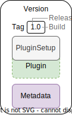

## Managing Plugins

As mentioned earlier, plugins built by Aragon and third-party developers can be added and removed from your DAO to adapt it to your needs.

The management of these plugins is handled for you by the aragonOS framework infrastructure so that the process of

- releasing new plugins as well as
- installing, updating, and uninstalling them to your DAO

becomes as streamlined as possible.

In the following, we learn what a plugin consists of.

<!-- Add subgraphic from the framework overview main graphic-->

### What Does a Plugin Consist Of?

An aragonOS Plugin consist of:

- The `PluginSetup` contract

  - referencing the `Plugin` implementation internally and
  - containing the setup instruction to install, update, and uninstall it to an existing DAO

- a metadata URI pointing to a `JSON` file containing the

  - aragonApp frontend information
  - ABI information needed for the setup ABI

- a version tag consisting of a

  - release number
  - build number

 
  A schematic depiction of a plugin bundle consisting of a version tag, the plugin setup contract pointing to the plugin implementation contract, and a metadata URI.

The `PluginSetup` is written by you, the plugin developer. The processing of the setup is managed by the `PluginSetupProcessor`, the central component of the setup process in the aragonOS framework, which is explained in the section [The Plugin Setup Process](./02-plugin-setup/index.md).

Each plugin with its different builds and releases is versioned inside its own plugin repositories in a `PluginRepo` contract.
These are created for you when you publish a `PluginSetup` contract new version to the aragonOS framework, which is explained in the section about [The Plugin Repo Creation](./02-plugin-setup/index.md)
