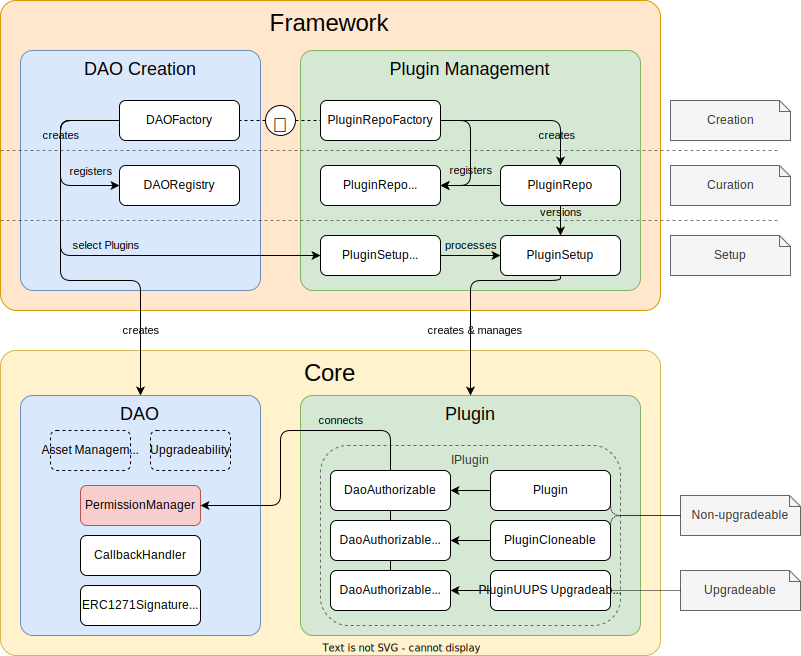

## The Infrastructure Running the AraongOS Protocol

The aragonOSx protocol is composed of **framework-related contracts** creating and managing the **core contracts**. This includes the

- [creation of DAOs](01-dao-creation/index.md) and initial plugin configuration
- [management of plugins](02-plugin-management/index.md), which includes the

  - the setup in existing DAOs
  - the versioning of different implementations and respective setup contracts, UI, and related metadata

- [assignment of ENS Names](./03-ens-names.md) to `Plugin` and `DAO` contracts created through the framework

An overview of the involved contracts and their iteractions is shown below:

 
  Overview of the framework and core contracts of the aragonOSx protocol.

In the following sections, you will learn more about the framework-related contracts of the aragonOSx protocol.
