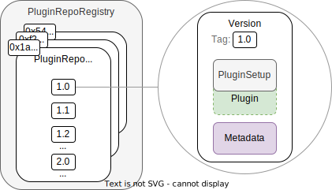

## The Plugin Repository Infrastructure

In this section, we take a close look on the contracts constituting the plugin ecosystem infrastructure.

An aragonOS Plugin consist of:

- The `Plugin` implementation contract containing the plugin's logic
- The `PluginSetup` contract referencing the `Plugin` implementation and containing the setup instruction to install, update, and uninstall it to a DAO
- the Aragon App frontend / UI

Each plugin has its own, unique ENS name and on-chain repository contract, the `PluginRepo`, in which different versions of the plugin are stored for reference.
The names and address of the `PluginRepo` contracts are stored in the `PluginRepoRegistry`. Both contracts are described in the following.
The `PluginSetupProcessor` contract taking care of installing, updating, and uninstalling is described in the context of [the plugin setup process](04-plugin-setup.md).

<div class="center-column">



<p class="caption"> 
  Schema showing the `PluginRepoRegistry` maintaining a list the addresses of ENS named `PluginRepo` contracts shown on the left. Each `PluginRepo` contract maintains a list of semantic versions of the `PluginSetup` contract (internally referencing the `Plugin` logic) and the associated UI building blocks as a URI, examplarily shown on the right.
</p>

</div>

In the following section, we will introduce the contracts.

### The `PuginRepo` Contract

The `PluginRepo` contract versions the releases of a `Plugin`. Each plugin starts as version `1.0.0`. Subsequent versions follow the [semantic versioning convention](https://semver.org/). For major, minor, and patch releases, the respective [version numbers are incremented](docs/core/../../../../../02-how-to-guides/01-plugin-development/03-publication/02-versioning.md).

Each semantic version released in the `PluginRepo` contract via the `createVersion` function

```solidity
function createVersion(
    uint16[3] memory _newSemanticVersion,
    address _pluginManager,
    bytes calldata _contentURI
)
```

This function references two pieces of information:

1. The address of `PluginSetup` contract internally referencing the implementation contract (to copy, proxy, or clone from it) and taking care of [installing, updating to, and uninstalling](04-plugin-setup.md) this specific version.
2. A URI string pointing to the contents defining the UI so that users on the Aragon DAO frontend can interact with it.

<!--TODO
:::note
To do: The following is a draft.
:::
Additionally, each released version has a

- status
  - submitted
  - review pending
  - accepted
  - rejected
  - vulnerable
- description / release note
- audit / review document summary
-->

### The `PluginRepoRegistry` Contract

The `PluginRepoRegistry` contract is the central contract listing all the plugins within the Aragon framework. Each plugin has its own ENS name (e.g. `my-cool.plugin.aragon.eth`) and its own `PluginRepo` contract, in which the different plugin versions are referenced.

:::note
To do
:::

<!--
- describe details on the registration requirements for a `PluginRepo`
  - registration: a proposal to the DAO
- describe mechanisms/rationale to prevent ENS name squatting / griefing
-->
