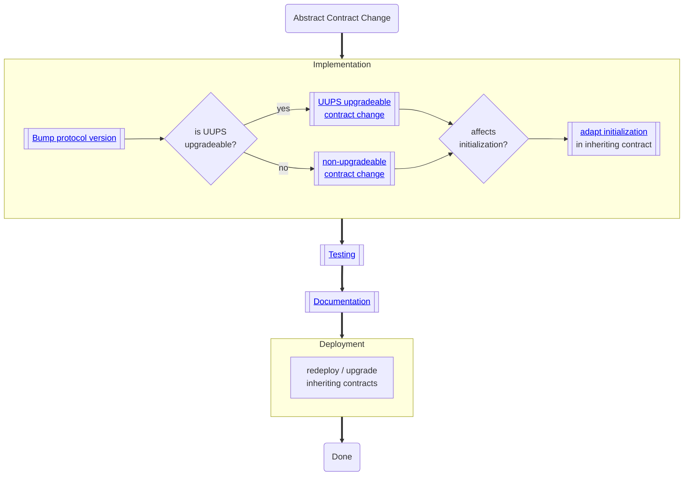

# Abstract Contract Change

Applies to:

- `PermissionManager`
- `CallbackHandler`
- `DaoAuthorizable` and `DaoAuthorizableUpgradeable`
- `Proposal` and `ProposalUpgradeable`

```mermaid
flowchart TD
    processStart("Abstract Contract Change")
    processStart ==> implementation
    subgraph implementation[Implementation]
        bumpProtocolVersion[["<a href='../03-sub-processes/protocol-version.md'>Bump protocol version</a>"]]
        isUpgradeable{"is UUPS \n upgradeable?"}
        upgradeableContractImplementation[[<a href='../03-sub-processes/upgradeable-contract.md'>UUPS upgradeable \n contract change</a>]]
        nonUpgradeableContractImplementation[[<a href='../03-sub-processes/non-upgradeable-contract.md'>non-upgradeable \n contract change</a>]]
        affectsInitialization{"affects \n initialization?"}
        adaptInitialization[["<a href='../03-sub-processes/contract-initialization.md'adapt initialization> adapt initialization</a>\n in inheriting contract"]]

        bumpProtocolVersion --> isUpgradeable
        isUpgradeable -->|yes| upgradeableContractImplementation --> affectsInitialization
        isUpgradeable -->|no| nonUpgradeableContractImplementation --> affectsInitialization
        affectsInitialization --> adaptInitialization
    end

    implementation ==> testing[[<a href='../03-sub-processes/testing.md'>Testing</a>]]
    %%subgraph testing[Testing]
    %%end


    testing ==> docs[[<a href='../03-sub-processes/documentation.md'>Documentation</a>]]
    %%subgraph testing[Testing]
    %%end

    docs ==> deployment
    subgraph deployment[Deployment]
        updateDerivedContracts["redeploy / upgrade \n inheriting contracts"]
    end

    deployment ==> processEnd("Done")
```
