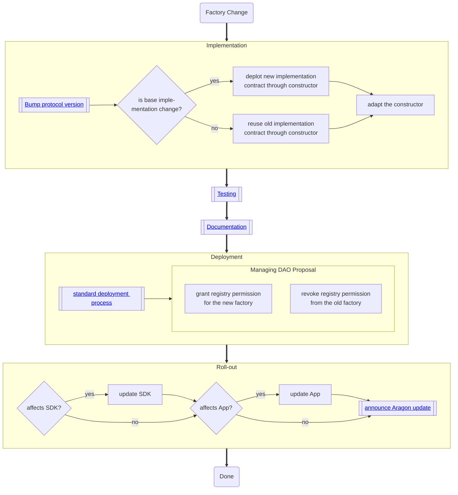

# Factory Change

Applies to

- `DAOFactory`
- `PluginRepoFactory`

For changes in the underlying implementations (i.e., `DAO` and `PluginRepo`), see the process of [replacing upgradeable contracts](../03-sub-processes/upgradeable-contract.md).

