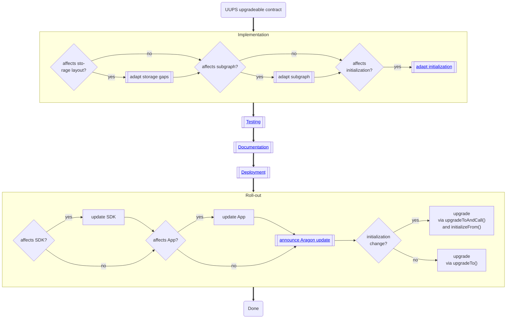

# UUPS Upgradeable Contract Change

```mermaid
flowchart TD
    processStart("UUPS upgradeable contract")
    processStart ==> implementation
    subgraph implementation[Implementation]
        affectsStorageGaps{"affects sto- \n rage  layout?"}
        adaptStorageGaps[["adapt storage gaps"]]

        affectsSubgraph{"affects subgraph?"}
        adaptSubgraph[["adapt subgraph"]]

        affectsInitialization{"affects \n initialization?"}
        adaptInitialization[["<a href='https://github.com/aragon/osx/blob/develop/packages/contracts/docs/developer-portal/04-framework-lifecycle/04-sub-processes/02-contract-initialization.md'> adapt initialization</a>"]]

        affectsStorageGaps -->|no| affectsSubgraph
        affectsStorageGaps -->|yes| adaptStorageGaps
        adaptStorageGaps --> affectsSubgraph

        affectsSubgraph -->|no| affectsInitialization
        affectsSubgraph -->|yes| adaptSubgraph
        adaptSubgraph --> affectsInitialization


        affectsInitialization -->|yes| adaptInitialization
    end

    implementation ==> testing[[<a href='https://github.com/aragon/osx/blob/develop/packages/contracts/docs/developer-portal/04-framework-lifecycle/04-sub-processes/03-testing.md'>Testing</a>]]

    testing ==> docs[[<a href='https://github.com/aragon/osx/blob/develop/packages/contracts/docs/developer-portal/04-framework-lifecycle/04-sub-processes/04-documentation.md'>Documentation</a>]]

    docs ==> deployment[[<a href='https://github.com/aragon/osx/blob/develop/packages/contracts/docs/developer-portal/04-framework-lifecycle/04-sub-processes/05-deployment.md'>Deployment</a>]]

    deployment ==> rollout
    subgraph rollout[Roll-out]

        sdkUpdate["update SDK"]
        affectsSDK{"affects SDK?"}
        affectsSDK -->|yes| sdkUpdate --> affectsApp
        affectsSDK -->|no| affectsApp

        appUpdate["update App"]
        affectsApp{"affects App?"}
        affectsApp -->|yes| appUpdate --> announceUpdate
        affectsApp -->|no| announceUpdate

        announceUpdate[["<a href='https://github.com/aragon/osx/blob/develop/packages/contracts/docs/developer-portal/04-framework-lifecycle/04-sub-processes/06-aragon-update.md'>announce Aragon update</a>"]]
        announceUpdate --> initializationChange

        initializationChange{"initialization \n change?"}
        initializationChange -->|yes| upgradeToAndCall["upgrade \n via upgradeToAndCall() \n and initializeFrom()"]
        initializationChange -->|no| upgradeTo["upgrade \n via upgradeTo()"]

    end

    rollout ==> processEnd("Done")
```
