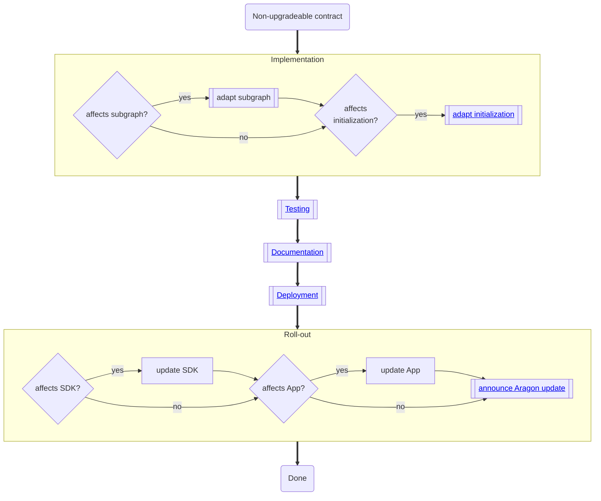

# Non-Upgradeable Contract Change

```mermaid
flowchart TD
    processStart("Non-upgradeable contract")
    processStart ==> implementation
    subgraph implementation[Implementation]

        affectsSubgraph{"affects subgraph?"}
        adaptSubgraph[["adapt subgraph"]]

        affectsInitialization{"affects \n initialization?"}
        adaptInitialization[["<a href='../04-sub-processes/02-contract-initialization.md'> adapt initialization</a>"]]

        affectsSubgraph -->|yes| adaptSubgraph --> affectsInitialization
        affectsSubgraph -->|no| affectsInitialization

        affectsInitialization -->|yes| adaptInitialization
    end

    implementation ==> testing[[<a href='../03-sub-processes/03-testing.md'>Testing</a>]]

    testing ==> docs[[<a href='../03-sub-processes/04-documentation.md'>Documentation</a>]]

    docs ==> deployment[[<a href='../03-sub-processes/05-deployment.md'>Deployment</a>]]

    deployment ==> rollout
    subgraph rollout[Roll-out]
        sdkUpdate["update SDK"]
        affectsSDK{"affects SDK?"}
        affectsSDK -->|yes| sdkUpdate --> affectsApp
        affectsSDK -->|no| affectsApp

        appUpdate["update App"]
        affectsApp{"affects App?"}

        announceUpdate[["<a href='../04-sub-processes/06-aragon-update.md'>announce Aragon update</a>"]]
        affectsApp -->|yes| appUpdate --> announceUpdate
        affectsApp -->|no| announceUpdate
    end

    rollout ==> processEnd("Done")
```
