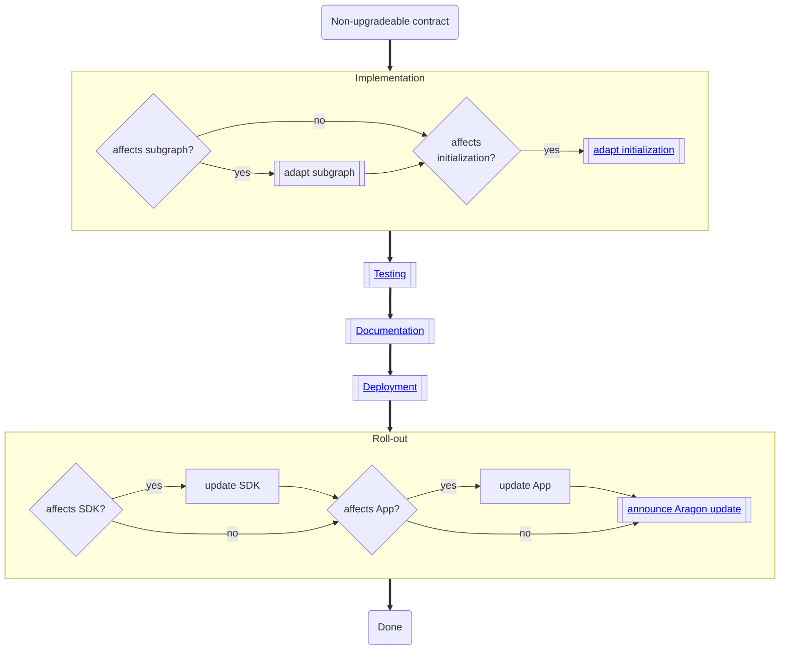

# Non-Upgradeable Contract Change

Hey Jessica, no worries. Generally, I would am up for this. It's just that I wasn't able to keep up with learning about the recent crosschain / L2/L3-voting development in the ecosystem.
The bigger problem I see (besides me not being on top of the recent development) is the following.
For both topics, account abstraction and crosschain Voting, we don't have a clear path or even opinion internally if and how we want to approach this subject on a technical level (i.e., do we want to implement this in OSx and if yes, how). Both topics are very challenging and as we are heavily understaffed atm.

Because we don't have a clear idea how to approach both topics, I would personally wait with this episode until this is the case. However, I personally feel very comfortable talking about the architecture and modularity roadmap of Aragon OSx (what we have build and what others can build on top) and future ideas we have. This would require little preparation from my side.
