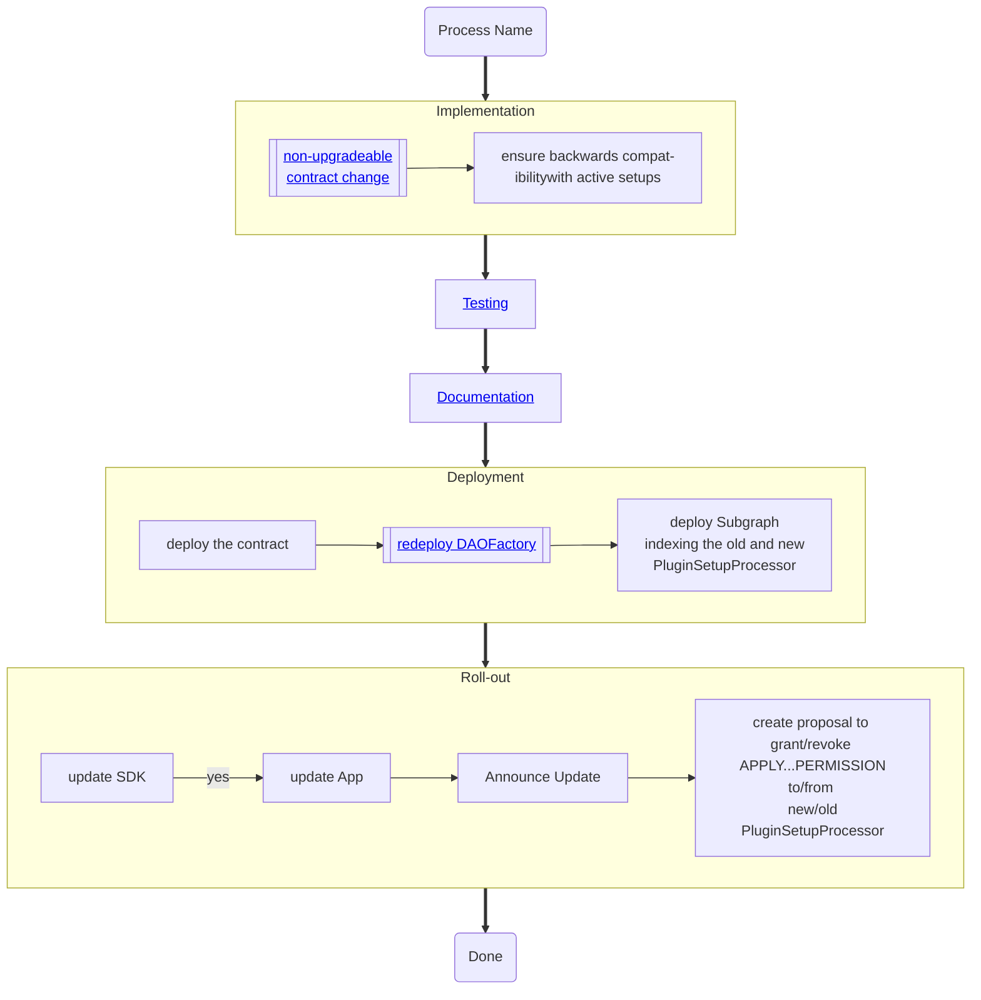

# `PluginSetupProcessor`

## Ensuring backwards compatibility

- ensure backwards compatibility with old setups
  - use the old `mapping(bytes32 => PluginState) public states;` mapping
  - Update Subgraph & SDK to be able to handle both old & new `PluginSetupProcessor`

## Roll-Out

Use the new contract in the Aragon CLI.
