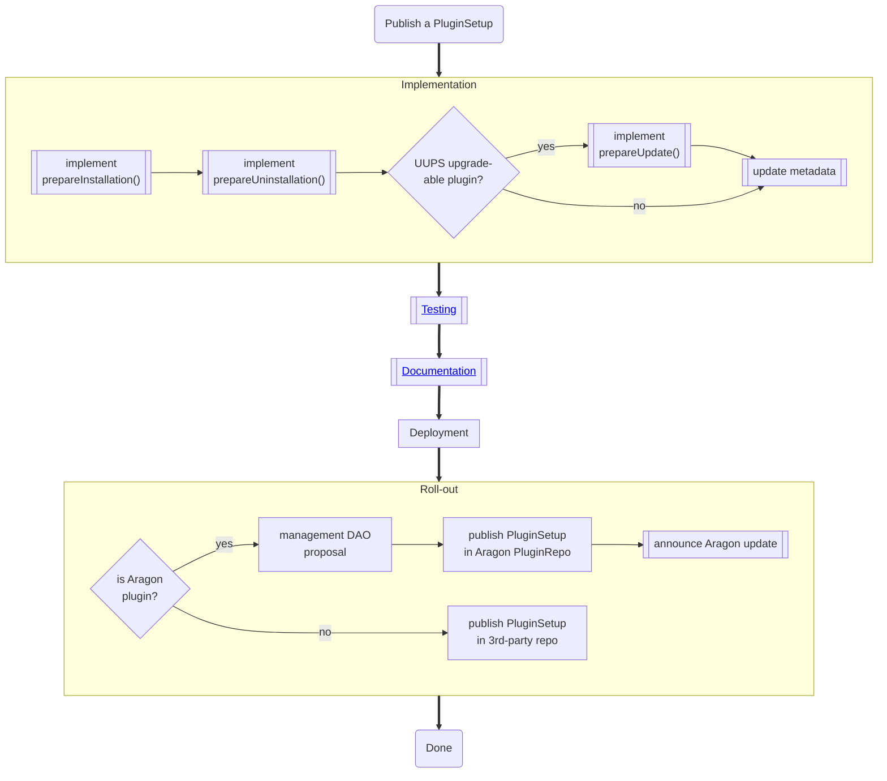

# Plugin Setup

:::todo
PAGE IS WORK IN PROGRESS
:::

```mermaid
flowchart TD
    processStart("Publish a PluginSetup")
    processStart ==> implementation
    subgraph implementation[Implementation]
        implementPrepareInstallation[["implement \n prepareInstallation()"]]
        implementPrepareUninstallation[["implement \n prepareUninstallation()"]]
        isUpgradeable{"UUPS upgrade- \n able plugin?"}
        implementPrepareUpdate[["implement \n prepareUpdate()"]]
        updateMetadata[["update metadata"]]

        implementPrepareInstallation --> implementPrepareUninstallation
        implementPrepareUninstallation --> isUpgradeable
        isUpgradeable -->|yes| implementPrepareUpdate --> updateMetadata
        isUpgradeable -->|no| updateMetadata
    end

    implementation ==> testing[[<a href='../03-sub-processes/testing.md'>Testing</a>]]
    %%subgraph testing[Testing]
    %%end

    testing ==> docs[[<a href='../03-sub-processes/documentation.md'>Documentation</a>]]
    %%subgraph testing[Testing]
    %%end

    docs ==> deployment
    subgraph deployment[Deployment]

    end

    deployment ==> rollout
    subgraph rollout[Roll-out]
        isAragonPlugin{"is Aragon \n plugin?"}
        managingDaoProposal["management DAO \n proposal"]
        announceUpdate[["announce Aragon update"]]

        publishToAragonPluginRepo["publish PluginSetup \n in Aragon PluginRepo"]
        publishToPluginRepo["publish  PluginSetup \n in 3rd-party repo"]

        isAragonPlugin -->|yes| managingDaoProposal --> publishToAragonPluginRepo --> announceUpdate
        isAragonPlugin --->|no| publishToPluginRepo

    end

    rollout ==> processEnd("Done")
```
