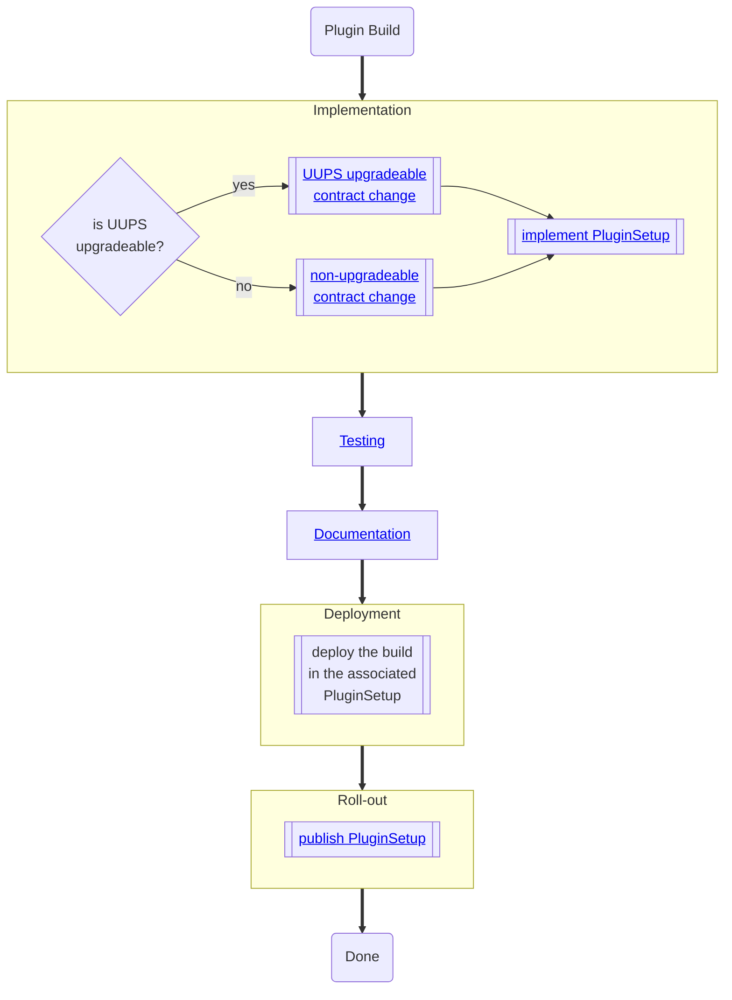

# Plugin Build

```mermaid
flowchart TD
    processStart("Plugin Build")
    processStart ==> implementation
    subgraph implementation[Implementation]
        isUpgradeable{"is UUPS \n upgradeable?"}
        upgradeableContractImplementation[[<a href='https://github.com/aragon/osx/blob/develop/packages/contracts/docs/developer-portal/04-framework-lifecycle/03-osx-components/02-upgradeable-contract.md'>UUPS upgradeable \n contract change</a>]]
        nonUpgradeableContractImplementation[[<a href='https://github.com/aragon/osx/blob/develop/packages/contracts/docs/developer-portal/04-framework-lifecycle/03-osx-components/03-non-upgradeable-contract.md'>non-upgradeable \n contract change</a>]]
        adaptPluginSetup[[<a href='https://github.com/aragon/osx/blob/develop/packages/contracts/docs/developer-portal/04-framework-lifecycle/03-osx-components/07-plugin-setup.md'>implement PluginSetup</a>]]
        isUpgradeable -->|yes| upgradeableContractImplementation --> adaptPluginSetup
        isUpgradeable -->|no| nonUpgradeableContractImplementation --> adaptPluginSetup

    end

    implementation ==> testing[<a href='https://github.com/aragon/osx/blob/develop/packages/contracts/docs/developer-portal/04-framework-lifecycle/04-sub-processes/03-testing.md'>Testing</a>]
    %%subgraph testing[Testing]
    %%end

    testing ==> docs[<a href='https://github.com/aragon/osx/blob/develop/packages/contracts/docs/developer-portal/04-framework-lifecycle/04-sub-processes/04-documentation.md'>Documentation</a>]
    %%subgraph testing[Testing]
    %%end

    docs ==> deployment
    subgraph deployment[Deployment]
        deployViaSetup[["deploy the build \n in the associated \n PluginSetup"]]
    end

    deployment ==> rollout
    subgraph rollout[Roll-out]
        publishPluginSetup[[<a href='https://github.com/aragon/osx/blob/develop/packages/contracts/docs/developer-portal/04-framework-lifecycle/03-osx-components/07-plugin-setup.md'>publish PluginSetup</a>]]
    end

    rollout ==> processEnd("Done")
```
