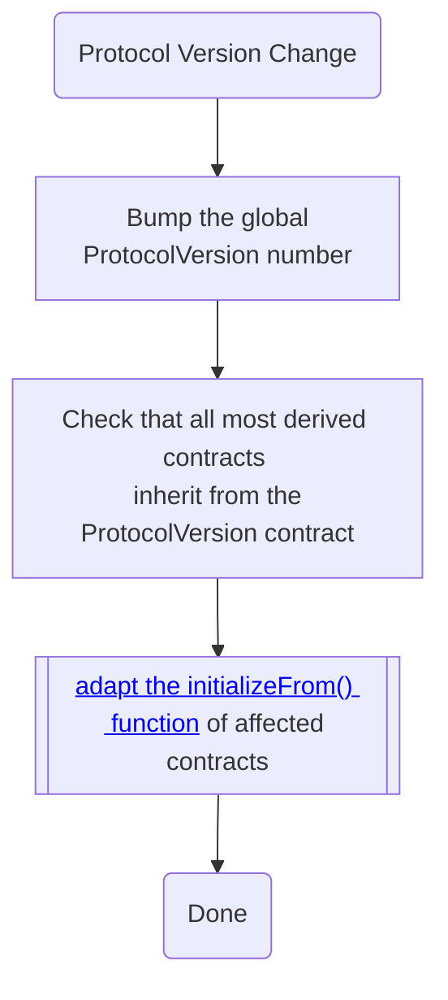

# Protocol Version Bump

## Semantic Versioning

We use the semver notation to version the OSx Protocol smart conctract and to classify changes into MAJOR, MINOR, or PATCH.

> Given a version number MAJOR.MINOR.PATCH, increment the:
>
> 1. MAJOR version when you make incompatible API changes
> 2. MINOR version when you add functionality in a backwards compatible manner
> 3. PATCH version when you make backwards compatible bug fixes

### Change Classications

We now classify [smart contract changes](../01-systems.md#smart-contracts) according to SemVer and how they affect

- [The subgraph](../01-systems.md#the-subgraph)
- [the SDK or 3rd party projects](../01-systems.md#sdk-3rd-party-projects-contract--subgraph-consumers) consuming the contracts and the subgraph
- [the App](../01-systems.md#app)

| SemVer Classification | Change in                       | Affected contracts    | Action                    | Contract Implication (OSx or 3rd party)                                | Subgraph                                                     | SDK                                                          | App                                                          |
| --------------------- | ------------------------------- | --------------------- | ------------------------- | ---------------------------------------------------------------------- | ------------------------------------------------------------ | ------------------------------------------------------------ | ------------------------------------------------------------ |
| major                 | storage change                  | stateful              | change, removal           | adaptation needed, potential exploits, unexpected behavior             | reverting calls, wrong values                                | reverting calls, wrong values                                | reverting calls, wrong values                                |
| major                 | inheritance                     | stateful, upgradeable | addition, change, removal | adaptation needed, storage corruption                                  |                                                              |                                                              |                                                              |
| major                 | event change                    | logging               | change, removal           |                                                                        | adaptation needed, errors                                    | adaptation needed, reverting calls                           | reverting calls                                              |
| major                 | external function header change | interface reliant     | change, removal           | adaptation needed, reverting calls                                     | errors                                                       | errors, reverting calls                                      | adaptation needed, errors                                    |
| major                 | external function removal       | interface reliant     | removal                   | adaptation needed, fallback triggering, reverting calls                | errors                                                       | adaptation needed, errors                                    | adaptation needed, errors                                    |
| major                 | enum change                     |                       | change, removal           | potential exploits, reverting calls, unexpected behavior, wrong values | unexpected behavior, wrong values                            | unexpected behavior, wrong values                            | unexpected behavior, wrong values                            |
| minor                 | storage addition                | stateful, upgradeable | addition                  |                                                                        |                                                              |                                                              |                                                              |
| minor                 | event addition                  |                       | addition                  |                                                                        | adaptation needed                                            | adaptation needed                                            |                                                              |
| minor                 | external function addition      |                       | addition                  | feature addition                                                       |                                                              | feature addition                                             | feature addition                                             |
| major, minor, patch   | external function body change   |                       | change                    | feature addition                                                       |                                                              |                                                              |                                                              |
| minor, patch          | internal function               |                       | addition, change, removal |                                                                        |                                                              |                                                              |                                                              |
| minor, patch          | enum addition                   |                       | addition                  |                                                                        | adaptation needed, errors, fallback triggering, wrong values | adaptation needed, errors, fallback triggering, wrong values | adaptation needed, errors, fallback triggering, wrong values |
| patch                 | custom error                    |                       | addition, change, removal | adaptation needed                                                      |                                                              | adaptation needed                                            |                                                              |
| patch                 | constant/immutable              |                       | addition, change, removal |                                                                        |                                                              |                                                              |                                                              |
| patch                 | compiler version                |                       | change                    | adaptation needed                                                      |                                                              |                                                              |                                                              |
| patch                 | file path                       | all                   | change                    | adaptation needed                                                      | adaptation needed                                            | adaptation needed                                            |                                                              |
