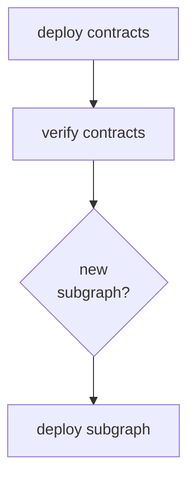

# Deployment

```mermaid
flowchart TD

    deployContracts["deploy contracts"]
    verifyContract["verify contracts"]

    newSubgraph{"new \n subgraph?"}
    deploySubgraph["deploy subgraph"]

    deployContracts --> verifyContract --> newSubgraph --> deploySubgraph


```
