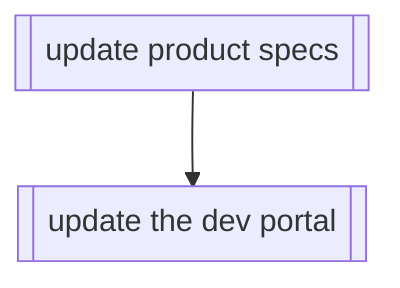

# Documentation

```mermaid
flowchart TD

    updateSpecs[["update product specs"]]
    updateDocs[["update the dev portal"]]

    updateSpecs --> updateDocs

```

## Update Product Specs

## Upgade the Developer Portal
