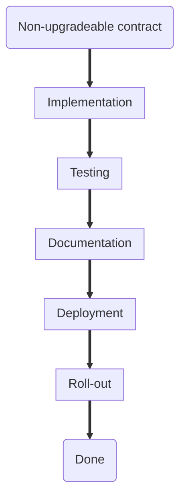

# Non-Upgradeable Contract Change

TODO TODO

```mermaid
flowchart TD
    processStart("Non-upgradeable contract")
    processStart ==> implementation
    subgraph implementation[Implementation]
    end

    implementation ==> testing
    subgraph testing[Testing]

    end

    testing ==> docs
    subgraph docs[Documentation]
    end

    docs ==> deployment
    subgraph deployment[Deployment]

    end

    deployment ==> rollout
    subgraph rollout[Roll-out]

    end

    rollout ==> processEnd("Done")
```
