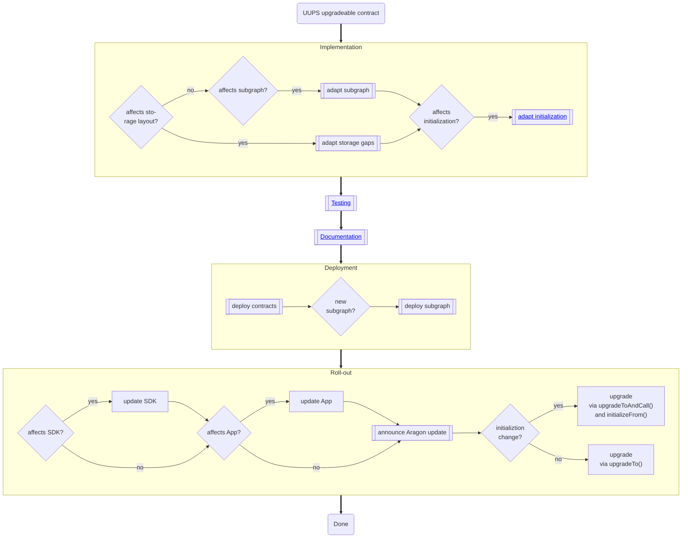

# UUPS Upgradeable Contract Change

Applies to

- `DAO`
- `PluginRepo`

```mermaid
flowchart TD
    processStart("UUPS upgradeable contract")
    processStart ==> implementation
    subgraph implementation[Implementation]
        affectsStorageGaps{"affects sto- \n rage  layout?"}
        adaptStorageGaps[["adapt storage gaps"]]

        affectsSubgraph{"affects subgraph?"}
        adaptSubgraph[["adapt subgraph"]]

        affectsInitialization{"affects \n initialization?"}
        adaptInitialization[["<a href='./protocol-version.md'adapt initialization> adapt initialization</a>"]]

        affectsStorageGaps -->|yes| adaptStorageGaps
        affectsStorageGaps -->|no| affectsSubgraph


        affectsSubgraph -->|yes| adaptSubgraph
        adaptSubgraph --> affectsInitialization

        adaptStorageGaps --> affectsInitialization
        affectsInitialization -->|yes| adaptInitialization
    end

    implementation ==> testing[[<a href='../03-sub-processes/testing.md'>Testing</a>]]
    %%subgraph testing[Testing]
    %%end

    testing ==> docs[[<a href='../03-sub-processes/documentation.md'>Documentation</a>]]
    %%subgraph testing[Testing]
    %%end

    docs ==> deployment
    subgraph deployment[Deployment]
        deployContracts[["deploy contracts"]]
        newSubgraph{"new \n subgraph?"}
        deploySubgraph[["deploy subgraph"]]

        deployContracts --> newSubgraph --> deploySubgraph

    end

    deployment ==> rollout
    subgraph rollout[Roll-out]

        sdkUpdate["update SDK"]
        affectsSDK{"affects SDK?"}
        affectsSDK -->|yes| sdkUpdate --> affectsApp
        affectsSDK -->|no| affectsApp

        appUpdate["update App"]
        affectsApp{"affects App?"}
        affectsApp -->|yes| appUpdate --> announceUpdate
        affectsApp -->|no| announceUpdate

        announceUpdate[["announce Aragon update"]]
        announceUpdate --> initializationChange

        initializationChange{"initializtion \n change?"}
        initializationChange -->|yes| upgradeToAndCall["upgrade \n via upgradeToAndCall() \n and initializeFrom()"]
        initializationChange -->|no| upgradeTo["upgrade \n via upgradeTo()"]

    end

    rollout ==> processEnd("Done")
```
