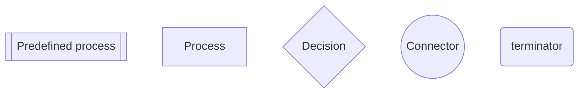

## Framework Lifecycle

This folder contains `mermaid` flow charts and accompanying process descriptions to help with replacing existing OSx contracts and related components by newer implementations. The current iteration only takes non-breaking changes into account.

### Legend

The shapes used in the diagrams and their meaning are shown below:

