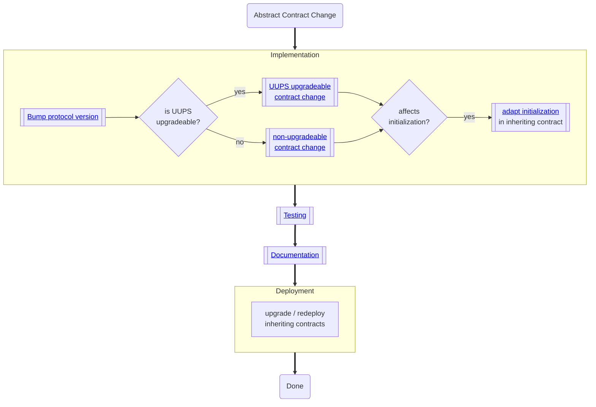

# Abstract Contract Change

```mermaid
flowchart TD
    processStart("Abstract Contract Change")
    processStart ==> implementation
    subgraph implementation[Implementation]
        bumpProtocolVersion[["<a href='https://github.com/aragon/osx/blob/develop/packages/contracts/docs/developer-portal/04-framework-lifecycle/04-sub-processes/01-protocol-version.md'>Bump protocol version</a>"]]
        isUpgradeable{"is UUPS \n upgradeable?"}
        upgradeableContractImplementation[[<a href='https://github.com/aragon/osx/blob/develop/packages/contracts/docs/developer-portal/04-framework-lifecycle/03-osx-components/02-upgradeable-contract.md'>UUPS upgradeable \n contract change</a>]]
        nonUpgradeableContractImplementation[[<a href='https://github.com/aragon/osx/blob/develop/packages/contracts/docs/developer-portal/04-framework-lifecycle/03-osx-components/03-non-upgradeable-contract.md'>non-upgradeable \n contract change</a>]]
        affectsInitialization{"affects \n initialization?"}
        adaptInitialization[["<a href='https://github.com/aragon/osx/blob/develop/packages/contracts/docs/developer-portal/04-framework-lifecycle/04-sub-processes/02-contract-initialization.md'adapt initialization> adapt initialization</a>\n in inheriting contract"]]

        bumpProtocolVersion --> isUpgradeable
        isUpgradeable -->|yes| upgradeableContractImplementation --> affectsInitialization
        isUpgradeable -->|no| nonUpgradeableContractImplementation --> affectsInitialization
        affectsInitialization -->|yes| adaptInitialization
    end

    implementation ==> testing[[<a href='https://github.com/aragon/osx/blob/develop/packages/contracts/docs/developer-portal/04-framework-lifecycle/04-sub-processes/03-testing.md'>Testing</a>]]
    %%subgraph testing[Testing]
    %%end


    testing ==> docs[[<a href='https://github.com/aragon/osx/blob/develop/packages/contracts/docs/developer-portal/04-framework-lifecycle/04-sub-processes/04-documentation.md'>Documentation</a>]]
    %%subgraph testing[Testing]
    %%end

    docs ==> deployment
    subgraph deployment[Deployment]
        updateDerivedContracts["upgrade / redeploy \n inheriting contracts"]
    end

    deployment ==> processEnd("Done")
```
