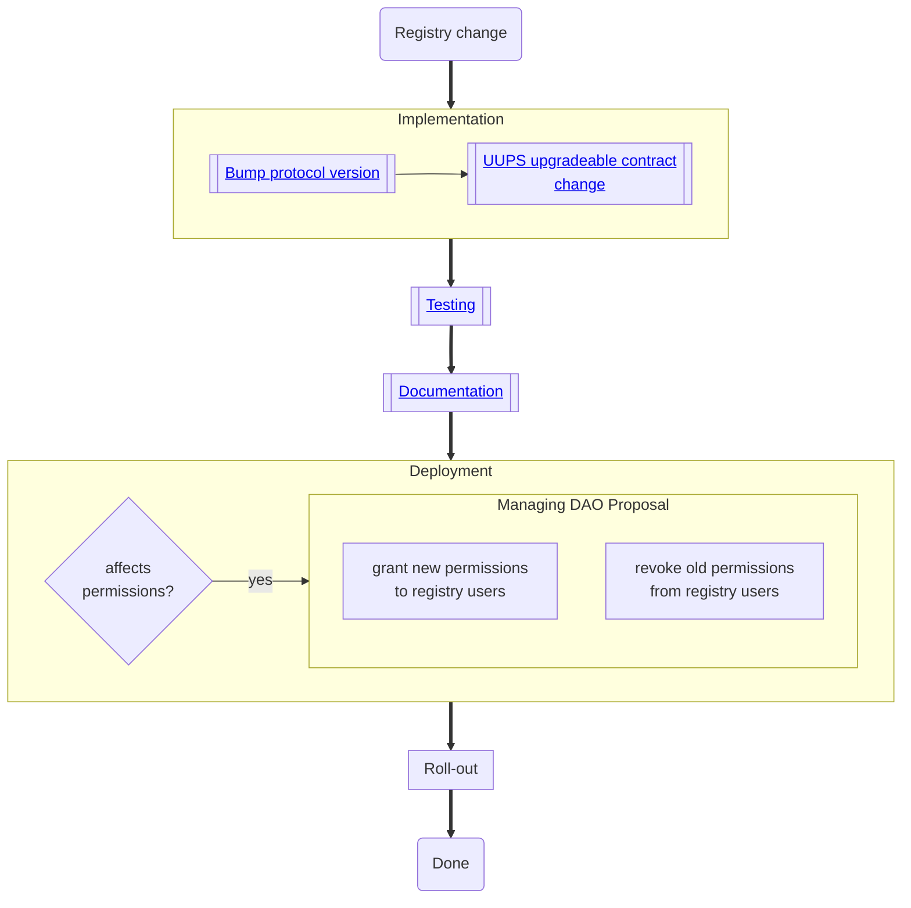

# Registry Contract Change

Applies to

- `DAORegistry`
- `PluginRepoRegistry`

```mermaid
flowchart TD
    processStart("Registry change")
    processStart ==> implementation
    subgraph implementation[Implementation]
        bumpProtocolVersion[["<a href='https://github.com/aragon/osx/blob/develop/packages/contracts/docs/developer-portal/04-framework-lifecycle/04-sub-processes/01-protocol-version.md'>Bump protocol version</a>"]]
        upgradeableContractImplementation[[<a href='https://github.com/aragon/osx/blob/develop/packages/contracts/docs/developer-portal/04-framework-lifecycle/03-osx-components/02-upgradeable-contract.md'>UUPS upgradeable contract \n change</a>]]

        bumpProtocolVersion --> upgradeableContractImplementation
    end

    implementation ==> testing[[<a href='https://github.com/aragon/osx/blob/develop/packages/contracts/docs/developer-portal/04-framework-lifecycle/04-sub-processes/03-testing.md'>Testing</a>]]
    %%subgraph testing[Testing]
    %%end

    testing ==> docs[[<a href='https://github.com/aragon/osx/blob/develop/packages/contracts/docs/developer-portal/04-framework-lifecycle/04-sub-processes/04-documentation.md'>Documentation</a>]]
    %%subgraph testing[Testing]
    %%end

    docs ==> deployment
    subgraph deployment[Deployment]
        affectsPermissions{"affects \n permissions?"}

        subgraph managingDaoProposal["Managing DAO Proposal"]
            grantNewPermissions["grant new permissions \n to registry users"]
            revokeOldPermissions["revoke old permissions \n from registry users"]
        end

       affectsPermissions -->|yes| managingDaoProposal
    end

    deployment ==> rollout
    subgraph rollout[Roll-out]
        %% todo
    end

    rollout ==> processEnd("Done")
```
