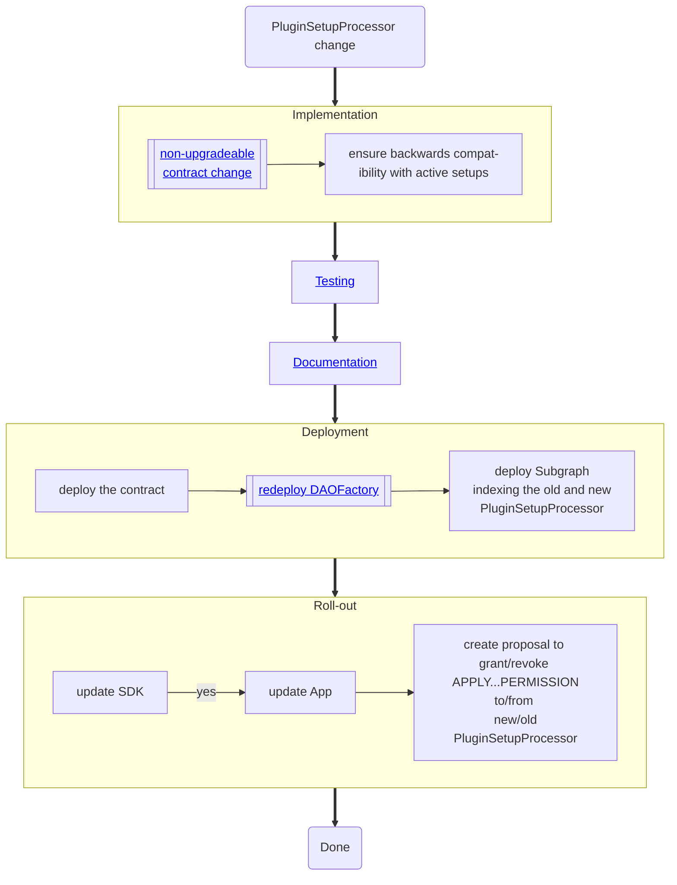

# `PluginSetupProcessor`

## Ensuring backwards compatibility

Active setups are maintained in the [`mapping(bytes32 pluginInstallationId => PluginState data) public states;` mapping](../../03-reference-guide/framework/plugin/setup/PluginSetupProcessor.md#public-variable-states).
The old public mapping in the outdated `PluginSetupProcessor` can be read and accessed in the new one to ensure active plugins can still be updated or uninstalled.

Make sure to also update the Subgraph and SDK to be able to handle both old & new `PluginSetupProcessor`

## Roll-Out

Use the new `PluginSetupProcessor` in the Aragon CLI.
