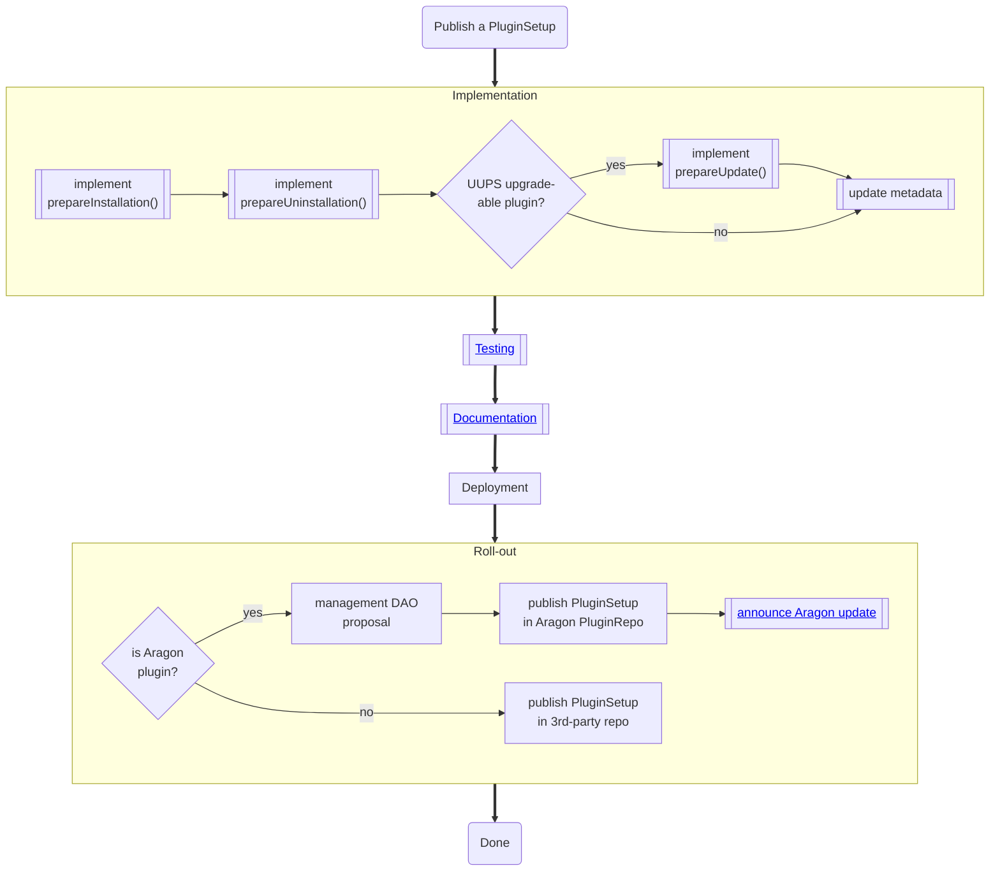

# Plugin Setup

## Implement `prepareInstallation`

Conduct all necessary actions to prepare the installation of a plugin.

- decode `_data` if required
- deploy the plugin (proxy) contract and return its address
- deploy helpers and return their addresses via the `preparedSetupData.helpers` array of addresses.
- request new permissions to be granted and return them via the `preparedSetupData.permissions` array of permission structs.

## Implement `prepareUninstallation`

Conduct all necessary actions to prepare the uninstallation of a plugin and to decommission it.

- decode `_payload._data` if required

- request existing permissions to be revoked and return them via the `preparedSetupData.permissions` array of permission structs.

## Implement `prepareUpdate`

- decode `_payload._data` if required
- return initialization data to be used with `upgradeToAndCall`
- transition

  - the `SetupPayload.plugin` contract
  - `SetupPayload.currentHelpers` contracts
  - and existing permission

  over from the `_currentBuild` to the new build by

  - deploying / decommissioning helpers return the addresses of the prevailing ones via the `preparedSetupData.helpers` array of addresses.
  - requesting to grant new / revoke existing permissions and returning them via the `preparedSetupData.permissions` array of permission structs.

## Update Metadata

- specify the encoding of `_data` / `_payload._data` for `prepareInstallation` / `prepareUninstallation` / `prepareUpdate` in the `build-metadata.json` file accompanying the setup according to the [metadata specs](../../02-how-to-guides/02-plugin-development/07-publication/02-metadata.md).
