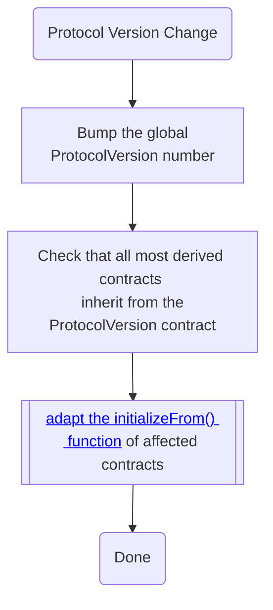

# Protocol Version Bump

```mermaid
flowchart TD

	processStart("Protocol Version Change")

	bumpProtocolVersion["Bump the global \n ProtocolVersion number"]
	mostDerivedCheck["Check that all most derived contracts \n inherit from the ProtocolVersion contract"]
	adaptInitializeFrom[["<a href='https://github.com/aragon/osx/blob/develop/packages/contracts/docs/developer-portal/04-framework-lifecycle/04-sub-processes/02-contract-initialization.md#adapting-the-initializefrom-function'>adapt the initializeFrom() \n function</a> of affected contracts"]]

	processStart --> bumpProtocolVersion

	bumpProtocolVersion --> mostDerivedCheck

	mostDerivedCheck --> adaptInitializeFrom

	adaptInitializeFrom --> processEnd("Done")
```

To asses what changes justify a MAJOR, MINOR, or PATCH version number bump, see the page on [SemVer Classification of OSx Contract Changes](../02-semver.md).
