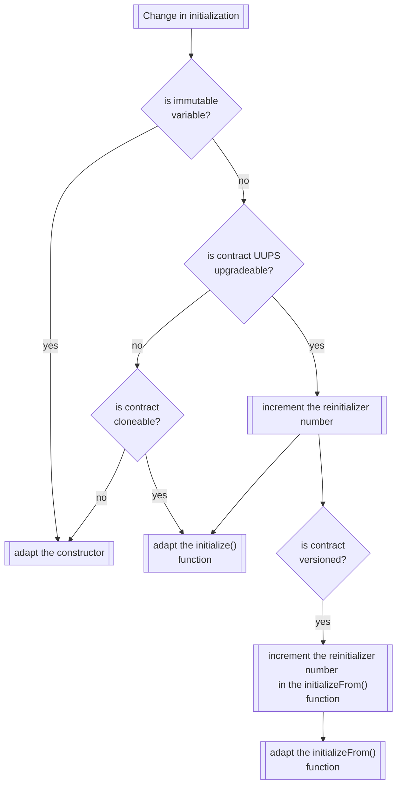

# Initialization Change



## UUPSUpgradeable Contracts

### Incrementing the `reinitializer` number

Let's imagine we released version 1.2.0 of an upgradeable contract.

```solidity
function protocolVersion() public pure returns (uint8[3] memory) {
  return [1, 2, 0];
}
```

and previously the following versions were released:

1. `1.0.0`
2. `1.0.1`
3. `1.1.0`
4. `1.1.1`

Accordingly, `v1.2.0` is the 5th version and our `reinitializer()` number is `5` (assuming that all versions require initialization).

### Adapting the `initialize` function

First, change the `reinitializer(5)` and make sure that there is a test for it.

Then do all the initialization changes and write a note, in which version they have been introduced (for easier traceability).

```solidity
function initialize(uint256 calldata _a, address calldata _c) external reinitializer(5) {
  // v1.0.0
  a = _a;

  // v1.0.1
  internalCallB();

  // v1.1.0
  c = _c;

  // v1.1.1
  emit EventD();

  // v1.2.0
  externalCallE();
  emit EventE();
}
```

### Adapting the `initializeFrom` function

This would result in an `initializeFrom` function of the following form:

```solidity
function initializeFrom(
  uint8[3] calldata _previousProtocolVersion,
  bytes calldata _initData
) external reinitializer(5) {
  // Ensure that the previous and current protocol MAJOR version numbers match. If not, revert because the upgrade is incompatible since breaking changes occurred.
  if (_previousProtocolVersion[0] != protocolVersion()[0]) {
    revert('Incompatible upgrade');
  }

  // Everybody will have at least a v1.0.0 contract initialized so we don't need to check for `_previousProtocolVersion.lte([1, 0, 0])`

  if (_previousProtocolVersion.lt([1, 0, 1])) {
    internalCallB();
  }

  if (_previousProtocolVersion.lt([1, 1, 0])) {
    c = _c;
  }

  if (_previousProtocolVersion.lt([1, 1, 1])) {
    emit EventD();
  }

  if (_previousProtocolVersion.lt([1, 2, 0])) {
    externalCallE();
    emit EventE();
  }
}
```

If we now upgrade from the previous version `1.0.1` to `1.2.0`, we would apply the initialization steps required for

- `1.1.0`
- `1.1.1`

Written this way, the `initializeFrom` function ensures that all initializations that have happened in between the two versions are applied.
