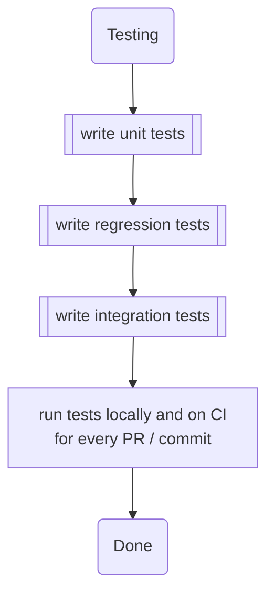

# Testing

Unit testing, integration testing, and regression testing are three distinct phases of software testing, each with its own scope and purpose. These testing types serve different roles in ensuring the quality and reliability of software applications.

In summary, unit testing focuses on verifying individual code units, integration testing ensures that units work together correctly, and regression testing guards against unintended side effects when changes are made to the software. All three testing types are essential for building robust and maintainable software applications, and they are often used in combination to achieve comprehensive test coverage.

## Unit Testing

**Scope:** Unit testing focuses on testing individual components or units of code in isolation. A unit can be a function, method, class, or a small section of code. The goal is to verify that each unit of code works correctly according to its design and specifications.
**Purpose:** Unit testing helps identify and fix bugs and issues at the smallest possible level, ensuring that individual units of code perform as expected. It also supports code maintainability and helps developers catch and address issues early in the development process.
**Testing Approach:** Typically, unit tests are isolated from external dependencies and use mock objects or stubs to simulate interactions with other components.

## Integration Testing

**Scope:** Integration testing focuses on testing the interactions between different units or components of a software system. It aims to ensure that these units work together as expected when integrated.
**Purpose:** Integration testing is crucial for identifying issues that may arise when units or modules interact, such as data transfer problems, communication errors, or inconsistencies in behavior. It helps verify that the components can communicate and collaborate effectively.
**Testing Approach:** Integration tests involve testing the interfaces, data flows, and interactions between various units or subsystems. Integration tests may be conducted incrementally, starting with simple interactions and gradually moving to more complex scenarios.

## Regression Testing

**Scope:** Regression testing is focused on ensuring that changes made to the software, such as new features, bug fixes, or enhancements, do not introduce new defects or negatively impact existing functionality. It involves retesting the entire application or a subset of it.
**Purpose:** The primary purpose of regression testing is to maintain the stability and reliability of the software over time. As the software evolves, new code changes can inadvertently break existing features. Regression tests help catch these regressions early.
**Testing Approach:** Regression tests can include both unit tests and integration tests, as well as system-level tests.

For our smart contracts, this kind of testing is important to make sure that we don't accidentally break the compatibility between existing contracts and new implementations.
They fill the gap between unit tests testing isolated functionalities and integration tests testing the interplay between contracts that all belong to the same OSx version.
This might include:

- upgradeability tests against previous contract versions including
  - checks for storage corruption
  - checks for reinitializer number bumps
- fork tests against currently active contracts (to ensure that interfaces and functionalities match with each other) such as
  - the `PluginSetupProcessor`
  - `PluginRepo`s
  - ...
