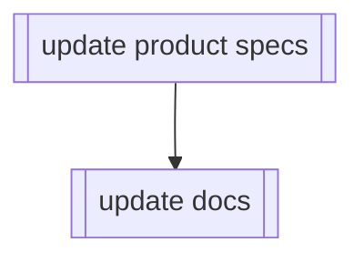

# Documentation

## Update the Product Specs

TODO ask Sarkawt on the process of updating the specs.

## Update the Documentation

Alter/improve/remove all relevant developer portal pages inside

- `packages/contracts/docs/developer-portal/01-how-it-works`
- `packages/contracts/docs/developer-portal/02-how-to-guides`

as well as relevant `README.md` files and checklists (i.e., `DEPLOYMENT_CHECKLIST.md` and `UPDATE_CHECKLIST.md`).
