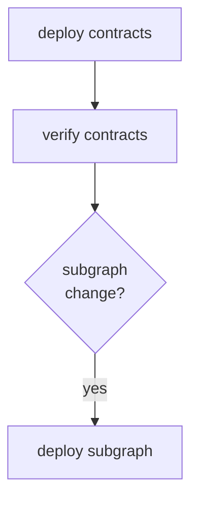

# Deployment

```mermaid
flowchart TD

    deployContracts["deploy contracts"]
    verifyContract["verify contracts"]

    newSubgraph{"subgraph \n change?"}
    deploySubgraph["deploy subgraph"]

    deployContracts --> verifyContract --> newSubgraph -->|yes| deploySubgraph


```
