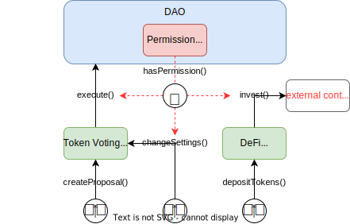

## Understanding Plugins

Plugins exist as instances created from the same base contract by

- copying
- cloning
- create proxy

and **each instance is attached to and managed by exactly one DAO**.

:::info
Lern more about the different [plugin types](../../../02-how-to-guides/02-plugin-development/02-plugin-types.md) in our How-to guide.
:::

This raises questions on how the DAO manages plugins and who actually owns plugins.

### How does the DAO Manage a Plugin?

A DAO manages plugins and interactions between them, the DAO contract, and other parties with its. In more detail, its permission manager

- controls the plugin setup process (installation, update, uninstallation)
- authorizes calls to plugin functions carrying the `auth` modifier
- authorizes calls to DAO functions, for example, the `execute` function allowing for acting as the DAO

by checking if the caller `hasPermission`.

 
  An examplary DAO setup showing interactions between the three core contract pieces triggered by different user groups: The <code>DAO</code> contract in blue containing the <code>PermissionManager</code> in red, respectively, as well as two <code>Plugin</code> contracts in green. 
  Function calls are visualized as black arrows and require permission checks (red, dashed arrow). In this example, the permission manager determines whether the token voting plugin can execute actions on the DAO, a member can change its settings, or if a DeFi-related plugin is allowed to invest in a certain, external contract.

Whereas deployed plugin instances belong to the DAO, the developer of the original plugin implementation owns the implementation and setup contract of the plugin. The plugin developer is the maintainer of an Aragon OSx [plugin repo](../../02-framework/02-plugin-management/01-plugin-repo/index.md). Finally, the Aragon OSx protocol manages the registry in which the plugin repositories are listed, which is required to install a plugin using the Aragon OSx framework infrastructure to your DAO.
