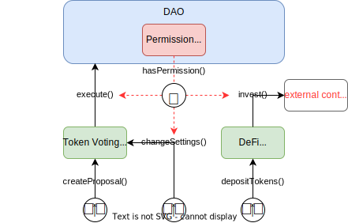

## The Contracts Constituting Your DAO

In a nutshell, your Aragon OSx DAO consists of three pieces:

1. **The DAO contract:** The DAO contract is where the **core functionality** of the protocol lies. It is in charge of:

   - Representing the identity of the DAO (ENS name, logo, description, other metadata)
   - Keeping the treasury
   - Executing arbitrary actions to
     - Transfer assets
     - Call its own functions
     - Call functions in external contracts
   - Providing general technical utilities (signature validation, callback handling)

2. **The Permission Manager:** The permission manager is part of the DAO contract and the center of our protocol architecture. It **manages permissions for your DAO** by specifying which addresses have permission to call distinct functions on contracts associated with your DAO.

3. **Plugins:** Any custom functionality can be added or removed through plugins, allowing you to **fully customize your DAO**. These plugins can be related to

   - Governance (e.g., token voting, one-person one-vote)
   - Asset management (e.g., ERC-20 or NFT minting, token streaming, DeFi)
   - Membership (governing budget allowances, gating access, curating a member list)

The underlying smart contracts constitute **the core contracts** of the Aragon OSx DAO framework.

The following graphic shows how an exemplary DAO setup, where the

 
  An examplary DAO setup showing interactions between the three core contract pieces triggered by different user groups: The <code>DAO</code> contract in blue containing the <code>PermissionManager</code> in red, respectively, as well as two <code>Plugin</code> contracts in green. 
  Function calls are visualized as black arrows and require permission checks (red, dashed arrow). In this example, the permission manager determines whether the token voting plugin can execute actions on the DAO, a member can change its settings, or if a DeFi-related plugin is allowed to invest in a certain, external contract.

In the upcoming sections, you will learn about each of them in more depth.

- [The DAO Contract: The Identity and Basis of Your Organization](./01-dao/index.md)
- [Permissions: Managing Your DAO](./02-permissions/index.md)
- [Plugins: Customizing your DAO](./03-plugins/index.md)
