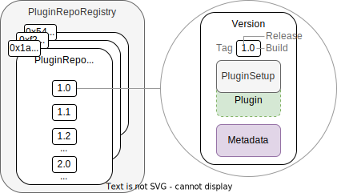

## Plugin Repositories

In this section you will learn how plugin repositories and the related Aragon OSx infrastructure works.

Each plugin has its own, unique ENS name and on-chain repository contract, the `PluginRepo`, in which different versions of the plugin are stored for reference using verstion tags constituted by a **release** and **build** number.
Different versions might contain

- bug fixes
- new features
- breaking changes

`PluginRepo` contracts themselves, each associated with a different plugin, are registered in the Aragon OSx [`PluginRepoRegistry`](./01-plugin-repo-creation.md/#the-pluginreporegistry-contract) and carry their own [ENS name](../../03-ens-names.md) that the creator chooses. The [`PluginRepoRegistry` contract](./01-plugin-repo-creation.md/#the-pluginreporegistry-contract) is described in the upcoming subsection.

<div class="center-column">



<p class="caption"> 
  Overview of the plugin versioning and registry in the Aragon OSx protocol. The `PluginRepoRegistry` contract, which is a curated list of ENS named `PluginRepo` contracts, is shown on the left. Each `PluginRepo` contract maintains a list of versions of the `PluginSetup` contract (internally referencing the `Plugin` implementation contract) and the associated UI building blocks as a URI, examplarily shown on the right.
</p>

</div>

### The `PluginRepo` Contract

The `PluginRepo` contract versions the releases of a `Plugin`. The first version of a plugin is always published as release 1 and build 1 (version tag `1.1`).
When you publish the first plugin version, a new plugin repository is automatically created for you by the Aragon OSx protocol in which you are the maintainer. The creation process is described in the [plugin repo creation process](./01-plugin-repo-creation.md) section.

The `PluginRepo` contract is [UUPS upgradeable](https://eips.ethereum.org/EIPS/eip-1822), inherits from the [`PermissionManager`](../../../01-core/02-permissions/index.md) and allows the maintainer of the repository to create new versions with the `createVersion` function:

```solidity title="@aragon/framework/repo/PluginRepo.sol"
/// @notice Creates a new plugin version as the latest build for an existing release number or the first build for a new release number for the provided `PluginSetup` contract address and metadata.
/// @param _release The release number.
/// @param _pluginSetupAddress The address of the plugin setup contract.
/// @param _buildMetadata The build metadata URI.
/// @param _releaseMetadata The release metadata URI.
function createVersion(
  uint8 _release,
  address _pluginSetup,
  bytes calldata _buildMetadata,
  bytes calldata _releaseMetadata
) external auth(address(this), MAINTAINER_PERMISSION_ID);
```

The function receives four input arguments:

- The `_release` number to create the build for. If the release number exists already (e.g., release `1`), it is registered as the latest build (e.g., `1.3` if the previous build was `1.2`). If it is a new release number, the build number is `1` (e.g., `2.1`).
- The address of `PluginSetup` contract internally referencing the implementation contract (to copy, proxy, or clone from it) and taking care of [installing, updating to, and uninstalling](../02-plugin-setup/index.md) this specific version.
- The `_buildMetadata` URI pointing to a JSON file containing the UI data, setup data, and change description for this specific version.
- The `_releaseMetadata` URI pointing to a JSON file containing the plugin name, description, as well as optional data such as images to be shown in the aragonApp frontend.

Other functions present in the contract allow you to query previous versions and to update the release metadata. For more details visit the [`PluginRepo` reference guide entry](../../../../03-reference-guide/framework/plugin/repo/PluginRepo.md).

The `PluginRepo` is created for you when you publish the `PluginSetup` contract of your first version to the Aragon OSx protocol, which is explained in the next section: [The Plugin Repo Creation Process](01-plugin-repo-creation.md).
