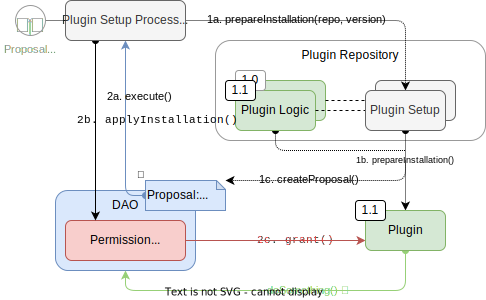
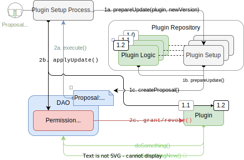
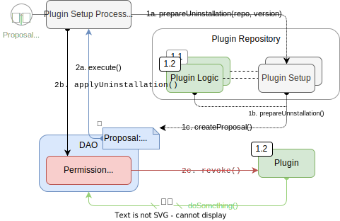

## The Plugin Setup Process

A DAO can be set up and customized by the **installation**, **update, and** **uninstallation** of plugins.
In this section you will learn how the plugin setup process and related infrastructure in Aragon OSx works.

In order for a plugin to function, associated contracts need to be deployed and gathered, often requiring permissions from the DAO.  
For example, a governance plugin will need permission to call the `execute` function in the DAO.

The required setup logic is written and taken care off by the plugin developer in the `PluginSetup` contract they create and that is associated with each `Plugin` contract version release (see [Developing a Plugin](../index.md)). The `PluginSetup` contract then interacts with the Aragon OSx framework so that installing, updating, and uninstalling a plugin to a DAO through the UI becomes very simple for the DAO end-user.

Except for the gas costs required, the installation, update, and uninstallation of plugins is completely free.

### Security Considerations

The plugin setup process is **security critical** because permissions are granted to third-party contracts.
Safety was our top priority in the design and we wanted to make sure that the DAO knows exactly which contracts receive which permissions before processing and making sure that the `PluginSetup` contracts developed by third parties don’t obtain elevated permissions (i.e., the `ROOT_PERMISSION_ID` permission) on the installing DAO during the setup process.

This is why we split the **plugin setup in two steps**:

1. **Preparation**
2. **Application**

Each plugin will then require both to run through the DAO's `PluginSetupProcessor` contract, which is part of the Aragon OSx framework.

:::note
Plugins can also be setup manually by calling `PluginSetup` contract and granting permissions directly through the `DAO` contract but won’t be displayed in the UI correctly.
:::

In the following, we describe the two steps in detail.

### Setup Preparation

The preparation of a plugin setup proceeds as follows:

1. A DAO builder selects a plugin with a specific version from the UI to install, uninstall, or update. Depending on the case, the `prepareInstallation`, `prepareUpdate`, or `prepareUninstallation` method in the `PluginSetup` contract associated with that version is called through the `PluginSetupProcessor` (and creates a unique setup ID).
2. The `PluginSetup` contract deploys all the contracts and gathers addresses and other input arguments required for the plugin setup. This can include:

   - deployment of new contracts
   - initialization of new storage variables
   - deprecating/decomissioning outdated (helper) contracts
   - ...

   Because the addresses of all associated contracts are now known, a static permission list can be emitted, hashed, and stored on-chain

3. The list containing the required permissions is then proposed as an `Action[]` array for processing in a proposal through a governance plugin of the installing DAO.

:::info
The governance plugin can be a simple majority vote, an optimistic process or an admin governance plugin that does not involve a waiting period. It can be any governance mechanism existing within the DAO.
:::

This gives the DAO time to see and check which permissions the `PluginSetup` contract request before processing them.
Plugin setup proposals must be carefully examined as they can be a potential security risk if the `PluginSetup` contract comes from an untrusted source. To learn more visit the [Security](./01-security-risk-mitigation.md) section.

<!-- TODO: add a costs sections

Optionally, the proposer can also request refunds for the gas spent for the preparation of the plugin in the proposal.
-->

### Setup Application

After this initial transaction, all contracts and addresses related to the plugin as well as their permissions are known and the DAO can decide if the proposal should be accepted or denied.
Once the proposal has passed, the actions specified in the `Action[]` array get executed and the prepared plugin setup is processed as follows:

1. The DAO temporarily grants the `ROOT_PERMISSION_ID` permission to the `PluginSetupProcessor`. This is needed so that the processor can modify the DAO's permissions settings to setup the plugin.
2. The next `Action` calls the `processInstallation`, `processUpdate`, or `processUninstallation` method in the `PluginSetupProcessor` depending on the setup process and with the permission list as an argument. The permission hash is compared with the stored hash to make sure that the permission didn’t change.
   In addition to the above, the update process also upgrades the logic contract to which the proxy points too.
3. If the hash is valid, the list is processed and `PluginSetupProcessor` conducts the requested sequence of `grant`, `grantWithCondition` and `revoke` calls on the owning DAO.
   Finally, the `PluginSetupProcessor` asks the DAO to revoke the `ROOT_PERMISSION_ID` permission from itself.

:::info
The two-step setup procedure in Aragon OSx is not limited to the setup of only one plugin — you can **setup multiple plugins at once** by first preparing them in a single proposal and then processing the entire setup sequence in one transaction. This is powerful and allows you to **transform your entire DAO in one proposal**, for example, to install a new governance plugin (e.g., a gasless ZK-vote) and finance plugin (e.g., to stream loans to your members), while uninstalling your old ERC20 token vote in one go.
:::

In the next sections, you will learn about how plugins are curated on Aragon's repository.

**a.** 
**b.** 
**c.** 

 
   Simplified overview of the two-transaction plugin <b>a.</b> installation, <b>b.</b> update, and <b>c.</b> uninstallation process with the involved contracts as rounded rectangles, interactions between them as arrows, and relations as dashed lines. The first and second transaction are distinguished by numbering as well as solid and dotted lines, respectively. 

