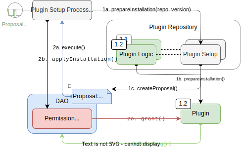

## The Smart Contracts Behind Plugins

A DAO can be set up and customized by the **installation, update, and uninstallation** of plugins. Plugins are composed of two key contracts:

- **Plugin contract:** contains the plugin's implementation logic; everything needed to extend the functionality for DAOs.
- **Plugin Setup contract:** contains the instructions needed to install, update, and uninstall the plugin into the DAO. This is done through granting or revoking permissions, enabling plugins to perform actions within the scope of the DAO.

How this works:

- Although a Plugin is composed by the `Plugin` and `PluginSetup` contracts, the Aragon OSx protocol only knows of the `PluginSetup` contract.
- Since the `PluginSetup` contract is the one containing the plugin installation instructions, it is the one in charge of deploying the Plugin instance. Each plugin instance is specific to that DAO, deployed with its own unique parameters. You can review how to build a `PluginSetup` contract [here](../../../../02-how-to-guides/02-plugin-development/index.md).
- The `PluginSetup` contract then interacts with the Aragon OSx framework's `PluginSetupProcessor` contract, which is in charge of applying the installion, update, or uninstallation of a plugin into a DAO.
- Publishing a Plugin into the Aragon OSx protocol is done through creating the first version of the plugin's `PluginRepo`. The plugin's `PluginRepo` instance stores all plugin versions. You can read more about that [here](../../../../02-how-to-guides/02-plugin-development/07-publication/index.md).
- Except for the gas costs required, plugins are completely free to install, unless decided otherwise by the developer.

### How are Plugins installed in DAOs?

The `PluginSetup` processing is **security critical** because the permissions it handles are granted to third-party contracts.

**Safety is our top priority in the design of the whole protocol.** We want to make sure that the DAO members know exactly what permissions are granted to whom before any processing takes place.

This is why we see the installation process in two phases:

1. **Preparation:** Defining the parameters to be set on the new plugin instance and helpers, as well as requesting the permissions needed for it to work properly. The `PluginSetup` contains the setup script where developers can perform any unprivileged operations. These will need a privileged confirmation in the next step.
2. **Application:** The granting or revoking of the plugin's requested permissions (based on the preparation step above). This is a privileged action performed by Aragon's `PluginSetupProcessor` (you can understand it as the "installer"), so that the plugin becomes effectively installed or uninstalled. It gets executed whenever someone with `ROOT` privileges on the DAO applies it (most likely through a proposal).

The `PluginSetupProcessor` is the Aragon contract in charge of invoking the `prepareInstallation()` function from your plugin's `PluginSetup` contract and use it to prepare the installation and (eventually) apply it once it has been approved by the DAO.

#### What happens during the Plugin Preparation?

The preparation of a `PluginSetup` contract proceeds as follows:

1. A DAO builder selects a plugin to install, uninstall, or update.

2. The DAO builder defines the parameters and settings that he/she wants for their DAO. Depending on the case, the `prepareInstallation`, `prepareUpdate`, or `prepareUninstallation` method in the `PluginSetup` contract is called through the `PluginSetupProcessor` (and creates a unique setup ID).

3. The [`PluginSetup`](https://github.com/aragon/osx/blob/develop/packages/contracts/src/framework/plugin/setup/PluginSetupProcessor.sol) contract deploys all the contracts and gathers addresses and other input arguments required for the installation/uninstallation/upgrade instructions. This can include:

   - deployment of new contracts
   - initialization of new storage variables
   - deprecating/decomissioning outdated (helper) contracts
   - governance settings or other attributes
   - ...

   Because the addresses of all associated contracts are now known, a static permission list can be emitted, hashed, and stored on-chain.

4. Once the Plugin installation has been prepared, we use it as the parameter of the `applyInstallation()` action. Once encoded, this action is what must be added to the `Action[]` array of the installation proposal. That way, when the proposal passes, the action becomes executable and the plugin can be installed in the DAO using the parameters defined in the prepare installation process. For a plugin to be installed, it needs to be approved by the governance mechanism (plugin) of the organization, passed as the encoded action of a proposal, and executed by a signer.

:::info
The governance plugin can be a simple majority vote, an optimistic process or an admin governance plugin that does not involve a waiting period. It can be any governance mechanism existing within the DAO which has access to the DAO's `execute` permission.
:::

This gives the DAO members the opportunity to check which permissions the `PluginSetup` contract request before granting/revoking them.

Plugin setup proposals must be carefully examined as they can be a potential security risk if the `PluginSetup` contract comes from an untrusted source. To learn more visit the [Security](./01-security-risk-mitigation.md) section.

<!-- TODO: add a costs sections

Optionally, the proposer can also request refunds for the gas spent for the preparation of the plugin in the proposal.
-->

#### What happens during the Preparation Application?

After this initial preparation transaction, the addresses and permissions related to the plugin become apparent. The members of a governance plugin with permissions can decide if the installation proposal should be accepted or denied.

Once the proposal has passed, the actions specified in the `Action[]` array can get executed and the `applyInstallation()` action is used to complete the installation of the plugin into the DAO.

This is processed as follows:

1. The DAO temporarily grants the `ROOT_PERMISSION_ID` permission to the `PluginSetupProcessor`. This is needed so that the processor can modify the DAO's permissions settings to set up the plugin.
2. This `Action` calls the `applyInstallation`, `applyUpdate`, or `applyUninstallation` method in the `PluginSetupProcessor`, containing the list of requested permissions as argument. The permissions hash is compared with the stored hash to make sure that no permission was changed.
   In addition to the above, the update process also upgrades the logic contract to which the proxy points too.
3. If the hash is valid, the list is processed and `PluginSetupProcessor` conducts the requested sequence of `grant`, `grantWithCondition` and `revoke` calls on the owning DAO.
   Finally, the `PluginSetupProcessor` asks the DAO to revoke the `ROOT_PERMISSION_ID` permission from itself.

:::info
The two-step setup procedure in Aragon OSx is not limited to the setup of only one plugin — you can **setup multiple plugins at once** by first preparing them in a single proposal and then processing the entire setup sequence in one transaction. This is powerful and allows you to **transform your entire DAO in one proposal**, for example, to install a new governance plugin (e.g., a gasless ZK-vote) and finance plugin (e.g., to stream loans to your members), while uninstalling your old ERC20 token vote in one go.
:::

In the next sections, you will learn about how plugins are curated on Aragon's repository.

**a.** 
**b.** 
**c.** 

   Simplified overview of the two-transaction plugin <b>a.</b> installation, <b>b.</b> update, and <b>c.</b> uninstallation process with the involved contracts as rounded rectangles, interactions between them as arrows, and relations as dashed lines. The first and second transaction are distinguished by numbering as well as solid and dotted lines, respectively.

